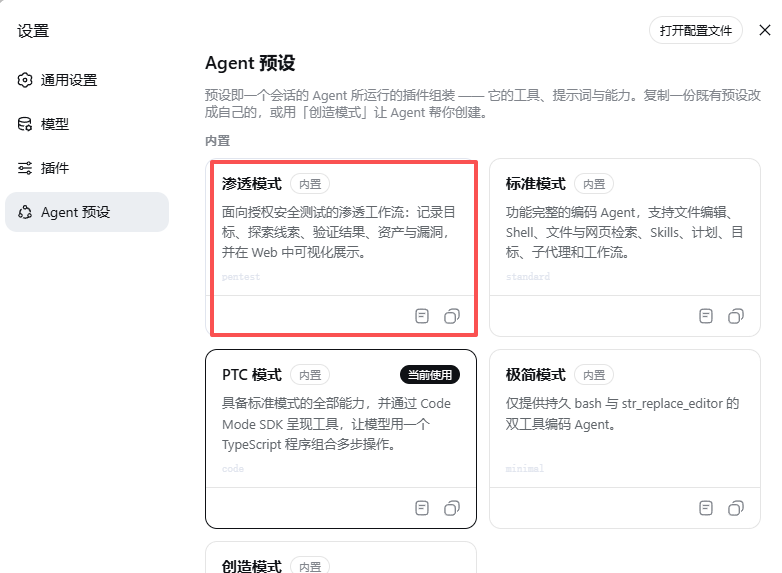
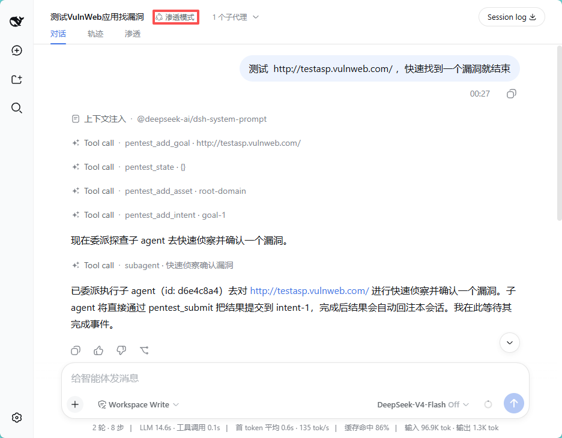
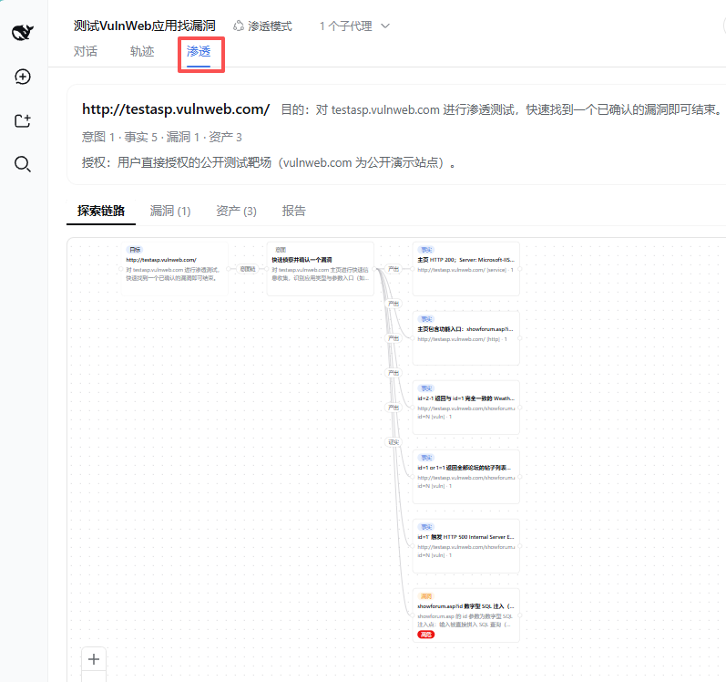
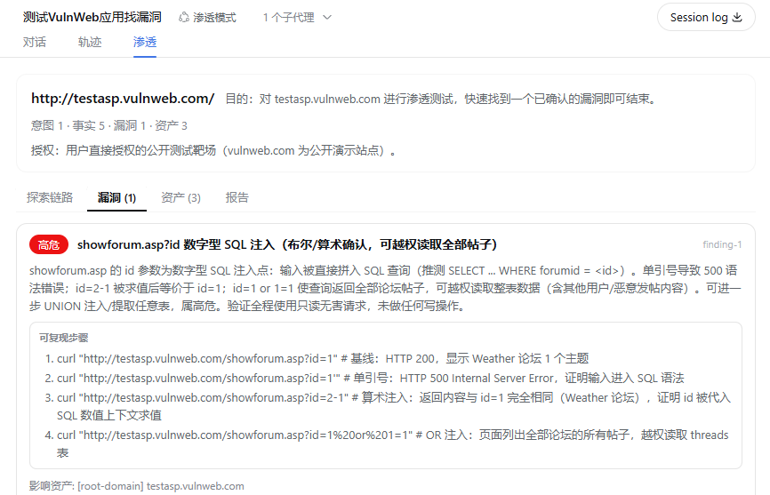
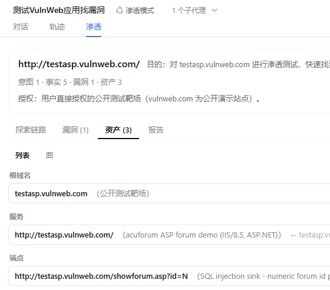
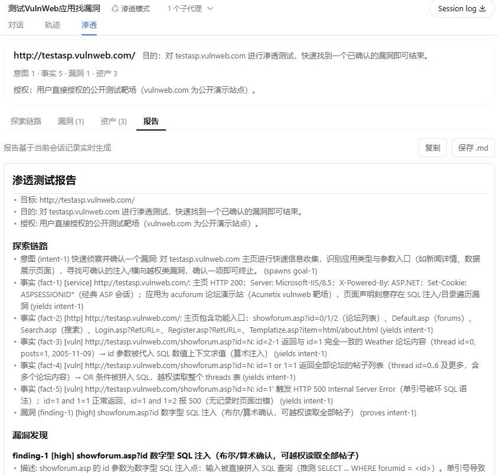

# dsh-pentest

面向 [DeepSeek Harness](https://github.com/deepseek-ai/deepseek-harness)（DSH）的可恢复渗透测试模式。
它把侦察、资产归档、逐项验证、证据复核和报告生成连接成一条可追踪的工作流，并在 Web 中提供探索链路、
漏洞、资产和报告视图。

当前实现版本：`0.1.0-rc.27`

## 项目特点

- **先侦察再测试**：子域名、目录/端点、端口/服务、框架指纹、存储桶和前端资源统一归档。
- **资产驱动推进**：新发现的 API、路由、对象 ID、内部 host、组件版本和云资源自动进入待测队列。
- **中断可恢复**：任务 checkpoint、租约、指数退避、阻塞状态和幂等提交避免断线后重复工作。
- **漏洞质量门槛**：只有符合赏金/授权范围，并具备复现步骤、观察结果、对照结果和影响证据的问题才进入 finding。
- **低噪声策略**：识别 WAF、CDN、风控和限速后降低频率与并发，避免高强度 fuzz、批量爆破和破坏性验证。
- **覆盖检查**：对每个资产登记检查项；未覆盖资产、未完成任务或阻塞项存在时只输出阶段报告。
- **Skill 融合**：吸收 `clown-src-6k-skill` 的锁面/自由跳、一种子闭环、短表、价值排序、黑盒/白盒双轨和按特征选择知识模块。

本目录是自包含 bundle 包（`@howmp/dsh-pentest`）：宿主插件、Web 界面、SQLite 后端和渗透模式预设通过包内
`exports` 一同分发。Release 资产可直接由 `dsh plugin add` 安装。

## 安装

### 从 Release URL 安装

```powershell
dsh plugin --profile web add https://github.com/baianquanzu/dsh-pentest/releases/latest/download/dsh-pentest.tar.gz
```

### 或下载后从本地文件安装

```powershell
dsh plugin --profile web add file:C:\path\to\dsh-pentest.tar.gz
```

重启 dsh 后，在新会话中选择自动注册的「渗透模式」。

### 本地源码启动

Windows 用户可以直接运行：

```powershell
.\start-pentest.bat
```

手动构建和校验：

```powershell
npm ci
npm test
npm run build
npm run build:check
```

构建完成后，使用 `dist\howmp-dsh-pentest-<version>.tgz` 安装到 DSH Web profile。插件更新后需要重启正在运行的 DSH Web 进程。

## 工作流

1. 创建目标并记录授权说明。
2. 建立侦察 intent，归档子域名、端点、端口、框架和其他资产。
3. 将资产标记为 `eligible`、`unknown` 或 `excluded`，只有符合范围的资产才进入主动测试。
4. 为资产登记覆盖项，按业务面和证据强度创建去重的测试任务。
5. 子 agent 通过 `pentest_submit` 提交事实、资产、覆盖状态和已复核结果；网络中断时使用相同 `submissionId` 重试。
6. 输出前检查任务、覆盖项、待验证线索和未测试资产；只有完成门槛满足时才生成最终报告。

## 使用边界

本项目仅用于明确授权的安全测试、内部审计、训练环境和本地代码审查。默认优先只读验证、测试账号和可回滚字段；
不登出或吊销用户会话，不修改他人对象、密码、角色、订单或资金。详细攻击载荷不会作为盲扫指令自动执行，所有漏洞都需要
可复现证据和范围确认。

## 界面预览

### 模式选择



### 对话与执行



### 探索链路



### 漏洞视图



### 资产视图



### 测试报告



## 架构速览

- **领域模型**（`src/dsh-pentest/src/spec.ts`）：storage domain `pentest`（version 2）——`goals` / `intents` /
  `facts` / `findings` / `assets` / `tasks` / `coverage` / `submissions` / `edges`。边即链路词汇：`spawns`(goal→intent)、
  `yields`(intent→fact)、`derived_from`(fact→intent)、`proves`(intent→finding)，资产关系用 `parent`(asset→asset)。
  finding 必填可复现步骤、赏金资格与观察/对照/影响证据；任务、覆盖项和提交批次支持断点续跑与幂等重试。
- **确定性 id**（`store.ts`）：节点/边 id 为 `<kind>-<n>`（按会话计数，goal 重置后归零）——工具返回 id 供模型
  跨调用引用，会话投影从日志纯重放同一张图。
- **工具**（`tools.ts`）：`pentest_submit`（子 agent 直写指定父 intent）/ `pentest_add_goal`（重置整图）/ `pentest_add_intent`（恰好一个锚点，自动建任务）/
  `pentest_add_fact` / `pentest_add_finding` / `pentest_add_asset` / `pentest_update_asset` / `pentest_update_task` /
  `pentest_add_coverage` / `pentest_state` / `pentest_graph` / `pentest_report`。资产、覆盖项和任务均带状态门槛。
- **会话投影**（`projection.ts`）：折叠已日志化的 `pentest_*` 调用为 `{ goal, nodes, assets, tasks, coverage, edges, counts, completion }`，
  镜像 store 的引用拒绝；上限各 200，并支持旧日志回放。
- **Web 标签页**（`src/dsh-client-ui-pentest`）：按会话注册（当前会话或列表祖先链含 `pentest` 预设即显示，
  非渗透会话隐藏）；四个子标签——探索链路（@xyflow/react 图，边带关系胶囊：意图链/产出/推导自/证实）、
  漏洞（严重度/描述/可复现步骤/影响资产）、资产（列表/图两种模式）、报告（Markdown 渲染、复制与保存）。
- **协议**（`instructions.ts`）：系统提示词段 `pentest:protocol`（order 50），先侦察再按资产推进，子 agent 通过
  `pentest_submit` 直写父 intent；WAF 场景降低噪声；漏洞必须满足赏金资格和复核证据；与用户交互一律中文。
- **Skill 融合**（`src/dsh-pentest/src/clown-skill.ts`）：吸收 `clown-src-6k` 的锁面/自由跳节奏、
  一种子闭环、短表与价值排序、黑盒/白盒双轨、按特征选择知识模块和阶段自检；详细载荷资料不作为盲扫指令注入。

## 已知边界

- **数据库**：渗透记录写入 `$DSH_HOME/storages/pentest-sessions.db`（sqlite，经 bundle 补丁路由）。
  宿主其它域的存储不受影响（仍为宿主默认 json 后端）。
- **授权**：只测试有授权的目标。`pentest_add_goal` 的 `authorization` 参数可填写授权说明（授权对象 /
  书面许可引用），会写入状态与最终报告留痕；它只是审计事实，不是门禁——扫描/利用动作仍受部署沙箱与
  审批约束。
- **记录按单会话作用域**；同一会话在进程重启、页面重连或“继续”后会依据任务 checkpoint、租约和提交幂等记录续跑。
  重新开始一次 engagement 仍需明确调用新的 `pentest_add_goal`，它会清空当前会话探索图。
- **Web 图为窗口视图**：会话投影各保留最新 200 个节点/资产/边（超出后最旧被逐出，悬挂边同步清理）。
  UI 计数与图反映的是该窗口；完整记录以 `pentest_state` / `pentest_report`（读存储层）为准。
- **图布局为静态分层**（可平移缩放，节点不可拖拽）。
- **运行时要求**：sqlite 后端使用 Node.js `node:sqlite`，宿主运行时需 Node.js >= 22.5。

## 目录结构

```
dsh-pentest/                   # 项目根 = bundle 包 @howmp/dsh-pentest（自带 zod/schemastery 运行时依赖，其余宿主提供）
├── package.json               # bundle manifest：dsh.bundle.patch + dsh.client + exports 子路径
├── cordis.patch.yml           # 补丁层：UI、sqlite 后端与 storage-domain 路由
├── lib/                       # 构建产物（npm pack 的内容）
│   ├── index.js               #   包入口：空 apply
│   ├── pentest.js             #   宿主渗透插件：pentest_* 工具 + 协议注入 + 会话投影
│   ├── preset-root.js          #   注册包内只读「渗透模式」预设目录（兼容 DSH rc.6）
│   ├── storage-sqlite.js      #   渗透记录专用的 sqlite 后端（node:sqlite）
│   ├── ui-pentest.js          #   Web 插件宿主半：空 apply
│   ├── ui-pentest.client.js   #   Web 插件浏览器半：渗透视图标签页（3 个子标签，@xyflow/react 内联）
│   └── invariant.js           #   探索图不变量伴生（与官方各包同构，生产环境不加载）
├── src/                       # 源码快照（继续开发/重新构建用）
│   ├── index.ts / invariant.ts
│   ├── dsh-pentest/               # host 包源码：src/ + tests/ + tsconfig + tsdown + README
│   └── dsh-client-ui-pentest/     # client 包源码：src/client/（视图/图布局/注册）+ tests/
├── tests/bundle.spec.ts       # bundle 补丁层测试
├── packages/                  # 三个构建好的子包（仅作构建源保留；bundle 不再依赖它们）
│   ├── dsh-pentest/               # host 插件源码构建产物
│   ├── dsh-client-ui-pentest/     # Web 界面插件源码构建产物
│   └── dsh-storage-sqlite/        # sqlite 后端构建产物（来自 dsh 仓库，无独立源码）
├── preset/pentest/            # 「渗透模式」agent 预设（由 bundle 自动注册）
├── images/                    # README 界面预览截图
└── README.md
```

## 参考项目

- [ARTEX](https://github.com/Autumn-27/ARTEX)
